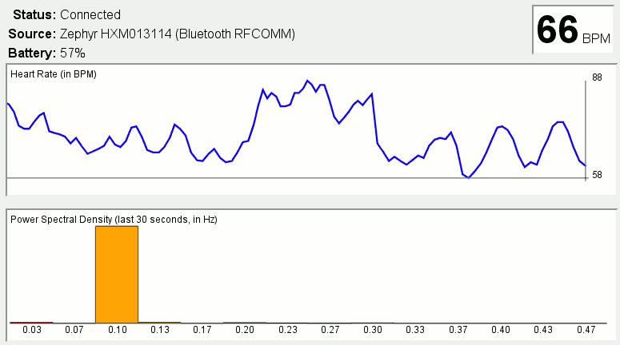

# Heart Rate Variability Monitor #

It is currently specialized for the Zephyr HxM Bluetooth monitor (**not** the more recent Zephyr HxM Smart version), but it is designed to easily integrate other sources in the future, as long as they can report R-R intervals in near-real-time.  It can either print a new line for each beat received in the command-line, or act as a local web server for its browser-based GUI.

## Features ##

The initial version will be coming here shortly.  It alreasy has all the features a layperson would expect from variability biofeedback software:

  * Display battery charge and current average BPM every second;

  * CLI: Display instantaneous BPM visually every second, making the terminal graph a history over time;

  * Both: Display a 14-band Power Spectral Density of the last 30 seconds of data, to visualize VLF, LF and HF variability;

  * GUI: Display a graph of the recent heart rate fluctuations.

## Short-Term Goal ##

As-is, the tool is already very usable for cardiac coherence biofeedback, for noticing ectopic beats (extrasystoles) and quantitatively monitoring sports recovery status.

I hope to build this tool up from there to be able to detect fluctuations in PSNS vs SNS activity (i.e. whole-body stress level) via PSD and instantaneous BPM observations, to set thresholds to alert of stress levels requiring attention.  (Perhaps a WebKit Notification, or some form of beeping, or simply making something big and RED appear / flash.)

## Screenshots ##

](hrvmonitor-beta-thumb.png)
